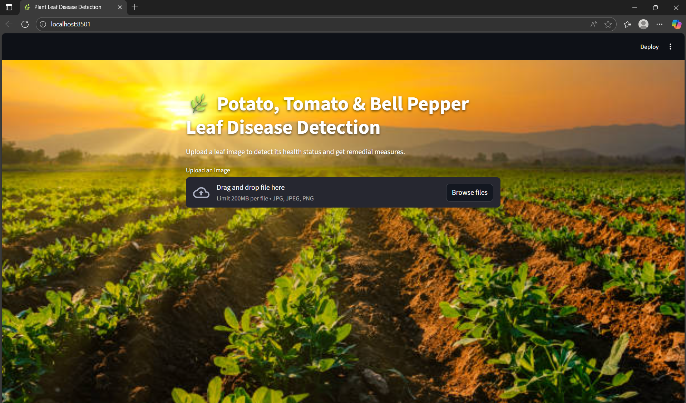
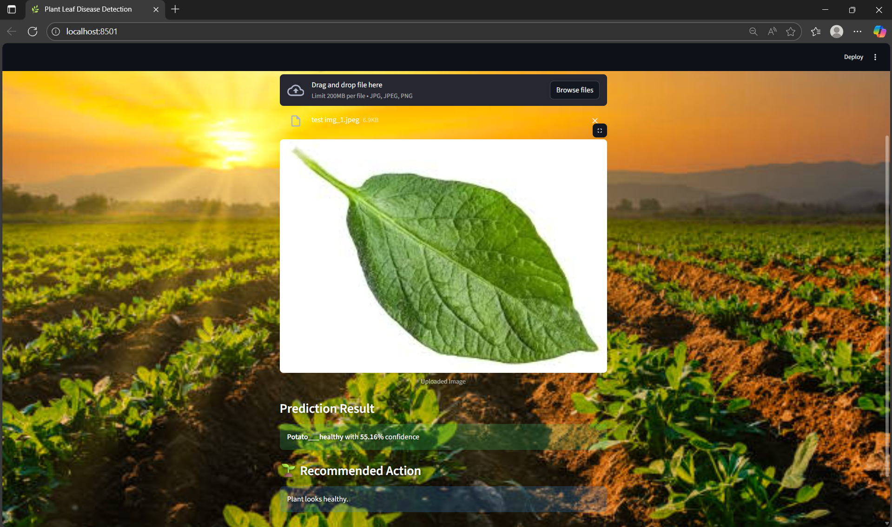

# 🌿 Plant Leaf Disease Detection using CNN

This project is a **Plant Leaf Disease Detection system** that uses a Convolutional Neural Network (CNN) to classify images of potato and tomato leaves into various disease categories or healthy classes. The project also provides remedial measures for detected diseases.

---

## 🔍 Project Overview

- **Objective:** Detect diseases in potato and tomato leaves using CNN.
- **Model:** MobileNet-based CNN trained on leaf images.
- **Frameworks:** TensorFlow, Keras, Streamlit.
- **Features:**
  - Upload leaf images via a web interface.
  - Detect disease class and confidence.
  - Recommend remedial actions for the detected disease.

---
## 💻 Tech Stack

**Frontend:** Streamlit, HTML/CSS  
**Backend:** TensorFlow, Keras  
**Model:** MobileNetV2 CNN trained on a potato & tomato leaf dataset

---

## 🌿 How It Works

1. Upload a leaf image using the app interface.  
2. The app resizes and preprocesses the image for the CNN model.  
3. The MobileNetV2 CNN predicts the disease class from 15 predefined categories.  
4. Recommended action is displayed alongside the prediction.

---

## 📥 Download Pre-trained Model

You can directly download the trained model here:

[Download `plant_cnn_mobilenet.h5`](https://huggingface.co/Pranet25/plant_cnn_mobilenet.h5/resolve/main/plant_cnn_mobilenet.h5)

---

## 🖼️ Demo


Web App user interface for plant leaf disease detection.


  
Displays the uploaded leaf, prediction result and recommended action.


---

## ⚡ Features

1. **Image Upload:** Users can upload leaf images in JPG, JPEG, or PNG formats.  
2. **Disease Classification:** Detects the type of disease or if the leaf is healthy.  
3. **Remedial Measures:** Provides recommended actions to treat the plant.   

---

## 🧩 Supported Classes

- Pepper:
  - `Pepper__bell___Bacterial_spot`
  - `Pepper__bell___healthy`
- Potato:
  - `Potato___Early_blight`
  - `Potato___Late_blight`
  - `Potato___healthy`
- Tomato:
  - `Tomato_Bacterial_spot`
  - `Tomato_Early_blight`
  - `Tomato_Late_blight`
  - `Tomato_Leaf_Mold`
  - `Tomato_Septoria_leaf_spot`
  - `Tomato_Spider_mites_Two_spotted_spider_mite`
  - `Tomato__Target_Spot`
  - `Tomato__Tomato_YellowLeaf__Curl_Virus`
  - `Tomato__Tomato_mosaic_virus`
  - `Tomato_healthy`

---

## ⚙️ Installation

1. Clone the repository:

```bash
git clone https://github.com/your-username/plant-leaf-disease-detection.git
cd plant-leaf-disease-detection
```

2. Install the required dependencies:

```bash
pip install -r requirements.txt
```
3. Run the streamlit app:

```bash
streamlit run app.py
```
